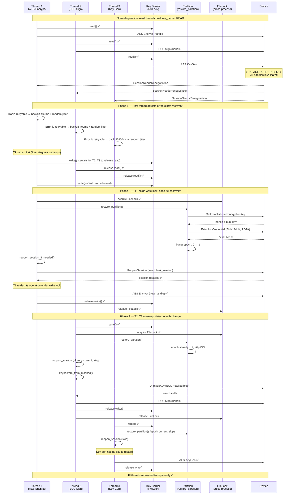
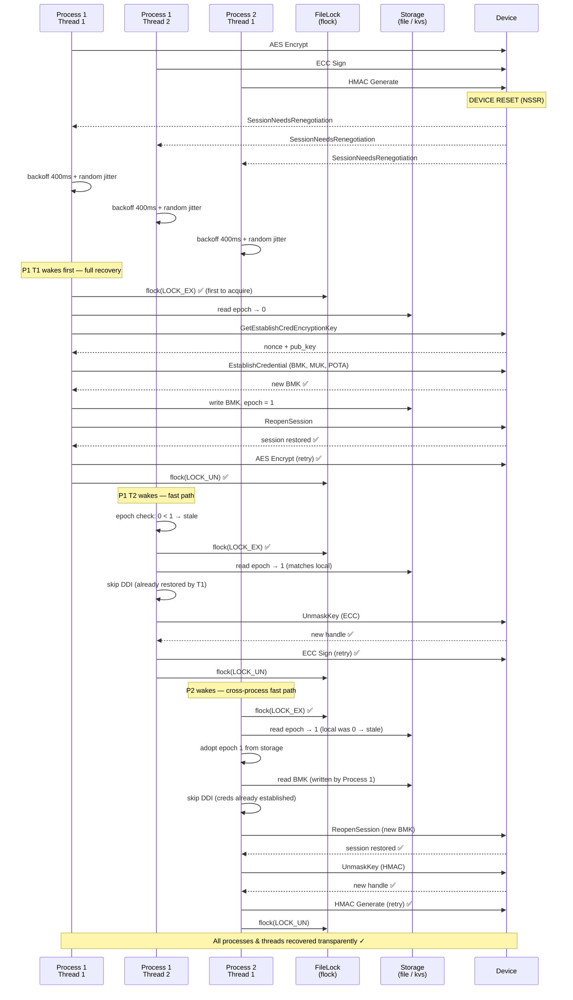

# Resiliency Design Document

## Overview

The AZIHSM SDK resiliency feature provides **transparent recovery** from
hardware disruptions — live migration (NSSR) and firmware crash recovery —
without requiring application-level retry logic. When a resiliency event
occurs, the SDK automatically:

1. Re-establishes partition credentials
2. Reopens sessions
3. Restores key handles from masked key material
4. Retries the interrupted operation

All of this is invisible to the caller: every API call either succeeds or
returns a non-transient error.

## Architecture Layers

```
┌──────────────────────────────────────────────────────┐
│  Application                                         │
├──────────────────────────────────────────────────────┤
│  Public API (HsmPartition, HsmSession, HsmKey*)      │
│    ├─ init()            #[resiliency_init_part]      │
│    ├─ open_session()    #[resiliency_open_session]   │
│    ├─ generate_key()    #[resiliency_key_gen]        │
│    ├─ sign/encrypt()    #[resiliency_key_op]         │
│    └─ cert_chain()      #[resiliency_cert_chain]     │
├──────────────────────────────────────────────────────┤
│  Retry Runtime (resiliency.rs)                       │
│    ├─ execute_with_retry()                           │
│    ├─ execute_open_session_with_retry()              │
│    ├─ execute_key_gen_with_retry()                   │
│    └─ execute_key_op_with_retry()                    │
├──────────────────────────────────────────────────────┤
│  Recovery (partition.rs)                             │
│    ├─ restore_partition()     ← credential restore   │
│    ├─ reopen_session_if_needed()                     │
│    └─ restore_from_masked()   ← key handle refresh   │
├──────────────────────────────────────────────────────┤
│  DDI Layer (ddi/)                                    │
│    ├─ init_part / init_part_raw_no_res               │
│    ├─ open_session / reopen_session                  │
│    └─ unmask_key_raw_no_res                          │
├──────────────────────────────────────────────────────┤
│                      Device                          │
└──────────────────────────────────────────────────────┘
```

## Configuration

Resiliency is enabled by passing an `HsmResiliencyConfig` to
`HsmPartition::init()`:

```rust
pub struct HsmResiliencyConfig {
    /// Persistent key-value storage for BMK, MUK, masked keys, and epoch.
    pub storage: Box<dyn ResiliencyStorage>,

    /// Cross-process/thread lock for serializing restore_partition calls.
    pub lock: Arc<dyn ResiliencyLock>,

    /// POTA re-endorsement callback (required when source is Caller).
    pub pota_callback: Option<Box<dyn PotaEndorsementCallback>>,
}
```

### Implementation Requirements

**`storage` (`Box<dyn ResiliencyStorage>`):**
- Must be thread-safe (callable from any thread concurrently).
- Writes must be durable and visible to other processes (for
  cross-process epoch and BMK coordination).
- Atomic writes recommended (e.g., write-to-temp + rename) to avoid
  partial reads during crashes.

**`lock` (`Arc<dyn ResiliencyLock>`):**
- Must be thread-safe (callable from any thread concurrently).
- Must work **cross-process** (e.g., `flock`-based), not just
  cross-thread.
- Must be non-reentrant — the SDK never nests lock acquisitions.

**`pota_callback` (`Option<Box<dyn PotaEndorsementCallback>>`):**
- Must be thread-safe (callable from any thread concurrently).
- Must **not** call methods on the same `HsmPartition` that is being
  initialized or restored — the partition's RwLock is held during the
  callback. The SDK retrieves the device's PID public key and
  PID certificate chain (PEM-encoded) and passes them as the
  `pid_pub_key_der` and `pid_cert_chain_pem` parameters, so the implementation
  only needs to sign the provided key.
- Called under the resiliency lock, so it should not block
  indefinitely.

For C API signatures, see `api/native/doc/chapter_10_data_structs.md`
(`azihsm_resiliency_config`, `azihsm_resiliency_storage_ops`,
`azihsm_resiliency_lock_ops`, `azihsm_pota_callback_ops`).

### Storage Keys

| Key              | Contents                        | Written by              |
|------------------|---------------------------------|-------------------------|
| `azihsm_bmk`     | Backup masking key              | `init()`, `restore()`   |
| `azihsm_muk`     | Masked unwrapping key           | `generate_key_pair()`   |
| `azihsm_epoch`   | Restore epoch (u64 LE)          | `restore_partition()`   |

### Validation

- Caller-sourced POTA **requires** `pota_callback = Some(...)`.
- TPM-sourced POTA **requires** `pota_callback = None`.
- Enforced by `ResiliencyState::validate_config()` during `init()`.

## Proc Macro Attributes

### `#[resiliency_init_part]`

**Applied to:** `ddi::init_part()`

Wraps the DDI credential-establishment call with retry-with-backoff.
Predicate: `is_init_retryable_error` (IoAborted, DeviceNotReady,
CredentialsNotEstablished, NonceMismatch, PartitionNotProvisioned,
EccVerifyFailed).

On retry, injects `__prev_error` so the function can detect
`EccVerifyFailed` and trigger POTA re-endorsement via the callback.

Condition: only retries when `resiliency_config.is_some()`.

### `#[resiliency_open_part]`

**Applied to:** `HsmPartitionManager::open_partition()`

Retries on `IoAborted` / `IoAbortInProgress` during device open.
Handles transient driver states during live migration startup.

### `#[resiliency_open_session(partition = "...")]`

**Applied to:** `ddi::open_session()`

Wraps the DDI open-session call with restore-partition recovery.
Predicate: `is_open_session_retryable_error`.

On transient error:
1. Applies exponential backoff
2. Calls `restore_partition()` to re-establish credentials
3. Retries the operation

No session reopen or key refresh is needed — the session does not
yet exist.

Condition: only retries when resiliency is enabled on the partition.

### `#[resiliency_cert_chain(partition = "...")]`

**Applied to:** `ddi::get_cert_chain()`

Wraps the DDI cert-chain retrieval with retry-with-backoff.
Predicate: `is_cert_chain_retryable_error`.

On retry, injects `__prev_error` (same `execute_with_retry` path
as `#[resiliency_init_part]`).

Condition: only retries when resiliency is enabled on the partition.

### `#[resiliency_key_gen(session = "...")]`

**Applied to:** Key generation functions (AES, ECC, RSA, XTS, GCM, HMAC).

Expands the function body into a closure passed to
`execute_key_gen_with_retry()`. On transient error:

1. Applies exponential backoff
2. Acquires the **key barrier write lock** (ABA protection)
3. Calls `restore_partition()` to re-establish credentials
4. Calls `reopen_session_if_needed()` to refresh the session
5. Retries the key generation (still under write lock)

No key unmask needed — the key doesn't exist yet.

### `#[resiliency_key_op(key = "...")]`

**Applied to:** Key operations (sign, encrypt, decrypt, derive, unwrap,
unmask, attest).

Expands into `execute_key_op_with_retry()` with a three-phase loop:

**Phase 1 — Read lock + epoch check:**
- If key epoch matches partition epoch → run DDI operation under read lock
- If key epoch < partition epoch → stale handle, skip to Phase 3
- If key epoch > partition epoch → logic bug → `InternalError`

**Phase 2 — Evaluate result:**
- Success → return
- Retryable error → backoff, increment attempt
- Non-retryable error → return error
- Stale epoch → proceed to Phase 3 (free, no backoff consumed)

**Phase 3 — Write lock + recovery:**
- Acquire key barrier write lock (blocks all in-flight key ops)
- `restore_partition()` → re-establish credentials
- `reopen_session_if_needed()` → refresh session
- `key.restore_from_masked()` → unmask key, get new handle
- Loop back to Phase 1

## Partition Restore

`restore_partition()` re-establishes credentials after a resiliency event:

```
1. Snapshot epoch (no lock)
2. Acquire cross-process FileLock
3. Re-acquire inner read lock
4. Double-check epoch (skip if another thread already restored)
5. Read BMK + MUK from persistent storage
6. Call init_part_raw_no_res() with stored keys
   └── re-endorses POTA if source is Caller (via callback)
7. Release read lock
8. Acquire inner write lock
9. On success:
   ├── Persist new BMK to storage
   ├── Update in-memory BMK/MOBK
   ├── Cache updated POTA endorsement
   └── Bump epoch (read storage → increment → write storage)
   On CredentialsAlreadyEstablished:
   └── Sync epoch from storage (adopt if > local)
```

### Cross-Process Coordination

The `ResiliencyLock` (typically file-based `flock`) serializes
`init()` and `restore_partition()` across threads and processes.
Only one can run DDI credential establishment at a time.

### MaskedKeyDecodeFailed Retry

`try_establish_credential()` handles stale cached BMK/MUK:
1. Try `establish_credential` with cached BMK/MUK
2. On `MaskedKeyDecodeFailed`: clear both from storage, retry with empty

## Session Reopen

`reopen_session_if_needed()` refreshes a stale session:

```
1. Fast path: compare session epoch vs partition epoch
   └── Equal → no-op; Greater → InternalError
2. Read cached credentials from partition
3. Read session material (seed, bmk_session) from session
4. Acquire session write lock (with_reopen_guard)
   └── Double-check epoch under lock (race protection)
5. Call ddi::reopen_session()
6. Update session epoch + bmk_session
```

The session write lock ensures only one thread reopens per epoch.
Racing threads block and observe the updated epoch.

## Key Restoration

Keys are restored by unmasking their cached masked key material:

```
1. acquire_restore_guard! macro:
   ├── Fast path: epoch check (no lock)
   ├── Slow path: acquire key inner write lock
   ├── Re-check epoch under lock
   └── Check deleted flag (don't resurrect deleted keys)
2. Extract masked_key from key props
3. Call ddi::unmask_key_raw_no_res() (or refresh_key_pair_raw_no_res)
4. Update key: new handle, new props, new epoch
```

### Key Types and Their Restore Paths

| Key Type        | Restore Function              | Notes                    |
|-----------------|-------------------------------|--------------------------|
| AES             | `unmask_key_raw_no_res`       | Single handle            |
| ECC (pair)      | `refresh_key_pair_raw_no_res` | priv handle + pub key    |
| RSA (pair)      | `refresh_key_pair_raw_no_res` | Uses unwrapping key path |
| AES-XTS         | `aes_xts_unmask_key_raw_no_res` | Two handles (key pair blob) |
| AES-GCM         | `unmask_key_raw_no_res`       | Single handle            |
| HMAC            | `unmask_key_raw_no_res`       | Single handle            |
| Generic Secret  | `unmask_key_raw_no_res`       | Single handle            |

## Epoch Mechanism

The **restore epoch** is a monotonically increasing counter that tracks
resiliency events:

- Starts at 0 (or seeded from storage on `ResiliencyState::new()`)
- Bumped by 1 after each successful `restore_partition()`
- Persisted to storage for cross-process visibility
- Keys and sessions cache their creation/restore epoch
- Stale epoch → key/session needs refresh before DDI call

### Epoch Invariants

- `key_epoch == partition_epoch` → handle is current, safe to use
- `key_epoch < partition_epoch` → stale, needs `restore_from_masked()`
- `key_epoch > partition_epoch` → **impossible** (logic bug → `InternalError`)
- Storage epoch always ≥ in-memory epoch (never goes backwards)

## Key Barrier (ABA Protection)

The `key_barrier` is a lightweight `RwLock<()>` on `HsmPartition`:

- **Read lock:** Held during epoch-check + DDI operation
  - Multiple threads may hold simultaneously
  - Prevents concurrent restore from reassigning handles mid-operation

- **Write lock:** Held during restore + reopen + key refresh
  - Blocks until all in-flight operations complete
  - Guarantees no stale-handle operation slips through

### ABA Problem

After a device reset, handle indices are recycled. Without the barrier:

```
Thread A: holds handle #5 (Key X) → DDI sign
         ← device resets, all handles destroyed →
Thread B: generates new key → gets handle #5 (Key Y)
Thread A: DDI sign completes with handle #5 → signs with Key Y, not Key X
```

The barrier prevents this by ensuring Thread A's operation either:
- Completes before the reset (under read lock), or
- Detects the stale epoch and refreshes (write lock blocks Thread B)

## Backoff Configuration

| Parameter        | Production    | Mock (test)  |
|------------------|---------------|--------------|
| `MAX_RETRIES`    | 5 (6 total)   | 5 (6 total)  |
| `BACKOFF_BASE_MS`| 400ms         | 8ms          |
| `BACKOFF_JITTER_MS` | 100ms      | 2ms          |

Backoff schedule (production): 400, 800, 1600, 3200, 6400ms + jitter.

## Error Classification

### Retryable Errors by Context

| Error                          | init | open_session | key_op | cert_chain |
|--------------------------------|------|--------------|--------|------------|
| IoAborted                      | ✓    | ✓            | ✓      | ✓          |
| IoAbortInProgress              | ✓    | ✓            | ✓      | ✓          |
| DeviceNotReady                 | ✓    | ✓            | ✓      | ✓          |
| CredentialsNotEstablished      | ✓    | ✓            |        | ✓          |
| NonceMismatch                  | ✓    | ✓            |        |            |
| PartitionNotProvisioned        | ✓    | ✓            |        | ✓          |
| EccVerifyFailed                | ✓    |              |        |            |
| SessionNeedsRenegotiation      |      |              | ✓      |            |
| PendingKeyGeneration           |      |              | ✓      |            |
| KeyNotFound                    |      |              | ✓      |            |
| CertChainChanged               |      |              |        | ✓          |

### "Already Established" Errors

When credentials are already established (another thread/process beat us):
- `KeyNotFound` — key table exists but queried key doesn't
- `PartitionAlreadyProvisioned` — partition init already done
- `VaultAppLimitReached` — app slot occupied

These are treated as success for `init()` callers (sync epoch from storage).

## Locking Architecture

### Lock Ordering

```
1. ResiliencyLock (FileLock) — cross-process, serializes init/restore
2. key_barrier (RwLock<()>) — intra-process, serializes key ops vs restore
3. inner (RwLock<HsmPartitionInner>) — partition state access
4. session inner (RwLock<HsmSessionInner>) — session state
5. key inner (RwLock<HsmKeyInner>) — per-key state
```

### parking_lot RwLock

The partition's `inner` RwLock uses `parking_lot::RwLock`, which has
**write-preferring** fairness: new `read()` acquisitions are blocked when
a `write()` is queued. This prevents writer starvation but makes
**reentrant reads deadlock** when a writer is waiting.

To avoid deadlocks, the code never nests `read()` acquisitions on the
same RwLock. Each method either acquires a short-lived read lock that
returns an owned value (dropping the guard immediately), or acquires
the lock in a scoped block that drops before the next acquisition.
DDI delegation methods on `HsmPartitionInner` (e.g., `open_session()`,
`cert_chain()`) encapsulate the `api_rev_range` access internally,
so the outer `HsmPartition` method needs only a single `read()` call.

## Recovery Sequence Diagrams

### Multi-Thread Recovery (Single Process)

Three threads are performing concurrent crypto operations when a device
reset (NSSR) occurs. The first thread to wake performs full credential
recovery; subsequent threads detect the bumped epoch and only refresh
their key handles.



### Multi-Process Recovery

Two processes share the same device. The `FileLock` serializes
`restore_partition()` across process boundaries. The second process
observes the epoch bump in shared storage and skips the DDI credential
establishment.



**Key observations:**

- The `FileLock` prevents two processes from both issuing
  `EstablishCredential` simultaneously (which would race on the device).
- The **epoch in shared storage** acts as a coordination signal: the
  second process reads it, discovers the increment, and skips the
  expensive DDI credential call.
- Within a single process, the **key barrier write lock** serializes
  recovery across threads. Across processes, the **FileLock** serializes
  recovery.
- Key restoration (`restore_from_masked`) and session reopen are always
  per-process (each process has its own session handles).

## POTA Re-endorsement

When POTA source is `Caller` and resiliency is enabled:

1. **Initial init:** Caller provides pre-signed POTA endorsement
2. **On retry after `EccVerifyFailed`:** The device regenerated its
   attestation key (e.g., after live migration). The
   `PotaEndorsementCallback::endorse()` is invoked to re-sign over
   the current device's PID public key (provided by the SDK).
   The SDK also provides the PID certificate chain.
3. **On restore_partition:** Always re-endorses (`reendorse = true`)
   since the device state may have changed.

The callback implementation must:
1. Sign the `pid_pub_key_der` (provided by the SDK) with the caller's
   private key
2. Return the (signature, signer_public_key) pair
3. Optionally validate the device using `pid_cert_chain_pem`

## MUK Persistence

The Masked Unwrapping Key (MUK) is persisted to resiliency storage
during RSA unwrapping key generation (`generate_key_pair` for RSA
unwrap keys). This allows `establish_credential` during restore to
reconstruct the device's unwrapping key state.

If the cached MUK is stale (returns `MaskedKeyDecodeFailed`),
`try_establish_credential` automatically clears both BMK and MUK from
storage and retries with empty values.

## init_part Flow

```
init(creds, bmk, muk, obk_config, pota_endorsement, resiliency_config)
│
├─ Validate resiliency config (Caller POTA needs callback)
├─ Acquire ResiliencyLock (FileLock)
│
├─ with_dev: ddi::init_part()
│  └─ #[resiliency_init_part] retry wrapper
│     └─ init_part_raw_no_res()
│        ├─ InitBk3 (or GetSealedBk3 fallback)
│        ├─ get_pota_endorsement() (Caller: data or callback; TPM: sign)
│        ├─ GetEstablishCredEncryptionKey (nonce)
│        ├─ Encrypt credentials with ephemeral ECDH
│        ├─ Resolve BMK/MUK from storage (if not provided)
│        └─ try_establish_credential()
│           ├─ EstablishCredential (with BMK/MUK)
│           ├─ On MaskedKeyDecodeFailed: clear storage, retry empty
│           └─ Persist new BMK to storage
│
├─ Resolve result:
│  ├─ Ok: cache BMK, MOBK, POTA
│  ├─ CredentialsAlreadyEstablished: read BMK from storage
│  └─ Other error: propagate
│
├─ Acquire inner write lock
├─ Set masked keys (BMK, MOBK)
├─ Create and store ResiliencyState
└─ Release all locks
```

## Testing

### Stress Tests

Located in `api/tests/src/resiliency/stress/tests.rs`:
- 8 worker threads × 500 iterations per worker
- Continuous reset thread firing every 1s (mock) / 7s (hardware)
- Tests cover: AES-CBC, ECC sign, HMAC, RSA, ECDH, HKDF, key gen,
  key delete, key unwrap, key unmask, cert chain, init_part, and
  ABA safety

### Fault Injection Tests

Using the `res-test` feature and `azihsm_res_test_dev` crate for
injecting NSSR faults mid-DDI-call (more precise than timer-based resets).

### Stress Tool

A standalone CLI tool for long-running, multi-process resiliency testing:
`tools/resiliency_stress/`. See its
[README](../../tools/resiliency_stress/README.md) for usage and options.
